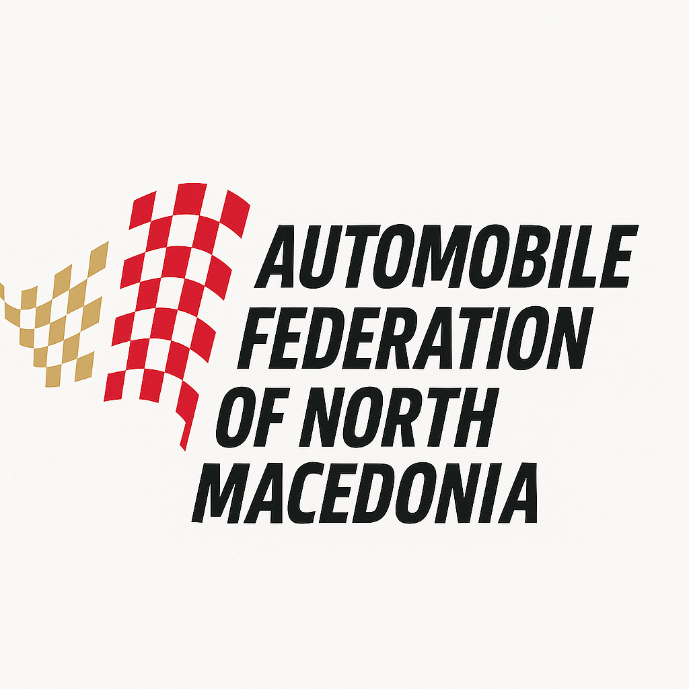
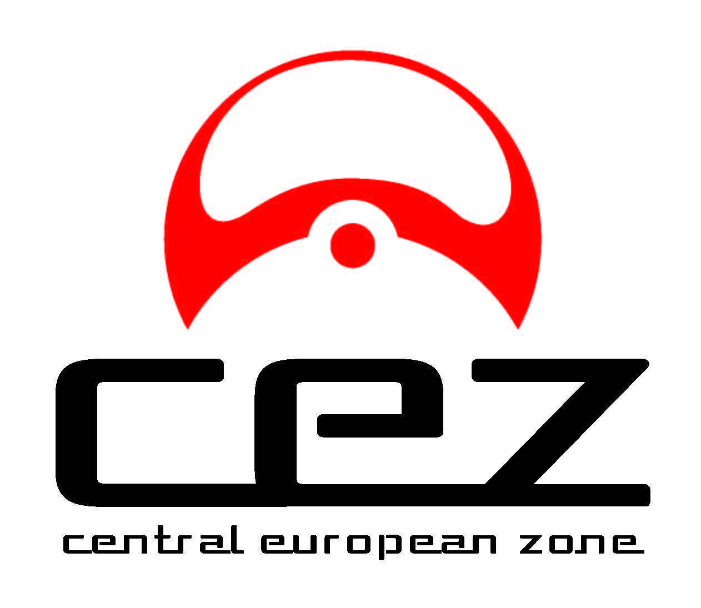
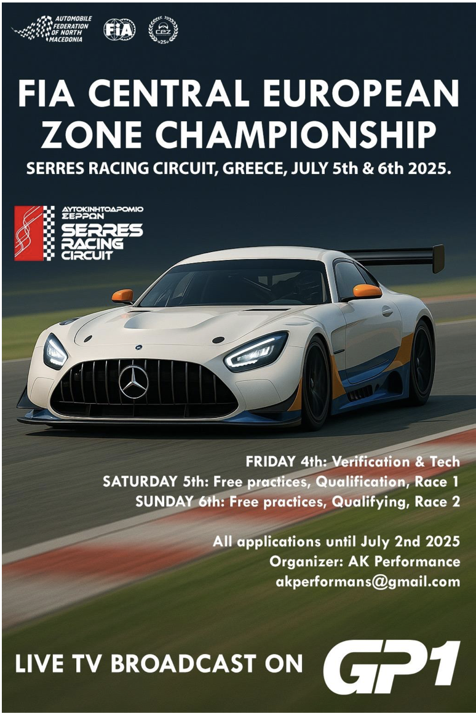

<!DOCTYPE html>
<html lang="en">
<head>
  <meta charset="UTF-8" />
  <meta name="viewport" content="width=device-width, initial-scale=1.0" />
  <title>Serres 2025 - Official Notice Board</title>
  
</head>
<body>
  

    🔔 Notification: <a href="https://docs.google.com/forms/d/1DSF5dxeb91_d1okZPqDh-hJF0cUHdqEudYTZYVjf4Co/preview" target="_blank" style="color: #000; text-decoration: underline;">Entry Form is now open — CLOSING DATE: Monday, 30th June 2025</a>
  

  <header>
    
    <h1>Serres 2025 - Official Press & Notice Board</h1>
    
Automobile Federation of North Macedonia - Technical Commission

    

      
      
    

  </header>

  <nav>
    <a href="#home">Home</a>
    <a href="#documents">Documents</a>
    <a href="#schedule">Schedule</a>
    <a href="#media">Media</a>
    <a href="bulletins.html">Bulletins Archive</a>
  </nav>

  <main>
    <section id="home">
      <h2>Latest Notices</h2>
      

        
Loading bulletins...

      

    </section>

    

    <section id="documents">
      <h2>Official Documents</h2>
      
Click below to download the latest regulations and bulletins.

      <a class="download-link" href="https://afm.com.mk/wp-content/uploads/2025/06/Supplementary-Regulation-SERRES-2025.docx.pdf" target="_blank">Download Supplementary Regulation</a>
    </section>

    <section id="schedule">
      <h2>Event Schedule</h2>
      
The full time schedule will be uploaded soon. Please check back regularly for updates.

    </section>

    <section id="media">
      <h2>Media</h2>
      
Photos and videos from the event will appear here.

      
    </section>

    <section id="weather">
      <h2>Current Weather at Serres Circuit</h2>
      

        <iframe
          width="100%"
          height="100%"
          src="https://embed.windy.com/embed2.html?lat=41.078&lon=23.550&detailLat=41.078&detailLon=23.550&width=650&height=450&zoom=10&level=surface&overlay=wind&menu=&message=true&marker=true&calendar=12&pressure=true&type=map&location=coordinates&detail=&metricWind=default&metricTemp=default&radarRange=-1"
          frameborder="0"
        ></iframe>
      

    </section>

    <section id="info">
      <h2>Event Information</h2>
      

        <strong>🏁 Name of the Event</strong>
        
<strong>CIRCUIT RACE AK PERFORMANS</strong>

        
📍 Place: Automotodrom Serres, Greece

        
📅 Date: 05th – 06th July 2025

      

      

        <strong>📦 Organizer</strong>
        

          AK PERFORMANS 
          Post address: ul: Franklin Ruzvelt br: 40/1-12 
          Telephone: +38976431880 
          E-mail: <a href="mailto:akperformans@gmail.com">akperformans@gmail.com</a>
        

      

      

        <strong>🧑‍⚖️ Officials</strong>
        

          Stewards Panel President: Pavle Donevski 
          Steward: Ranko Stanojkovski 
          Steward: Dean Grbac 
          Clerk of the Course: Kiril Karanakov 
          Chief of the Marshals: Autodrom SERRES 
          Secretary: Stefka Valeva 
          Chief Scrutineer: Autodrom SERRES 
          Scrutineering Assistant: Autodrom SERRES 
          Administrative Checks Manager: Stefka Valeva 
          Park Ferme and Paddock Manager: Mario Blazevski 
          Chief Timekeeper: Autodrom SERRES 
          Chief Medical Officer: Prim. Dr. Spec. Vasilaki Karabasev
        

      

      

        <strong>📌 Locations</strong>
        

          Race Control: Main Building, 1st Floor 
          Race Office: Main Building, 1st Floor 
          Stewards’ Office: Main Building, 1st Floor 
          Official Notice Board: Main Entrance of the Press Center, Ground Floor
        

      

      

        <strong>📢 Status of the Event</strong>
        

          - FIA CEZ Circuit and Endurance Championship 
          - Championship for North Macedonia 
          - TWINGO CUP 
          - CLIO CUP 
          - HONDA CUP 
          - BG CUP
        

      

    </section>
  </main>

  <footer>
    
&copy; 2025 Automobile Federation of North Macedonia

  </footer>
</body>
</html>
