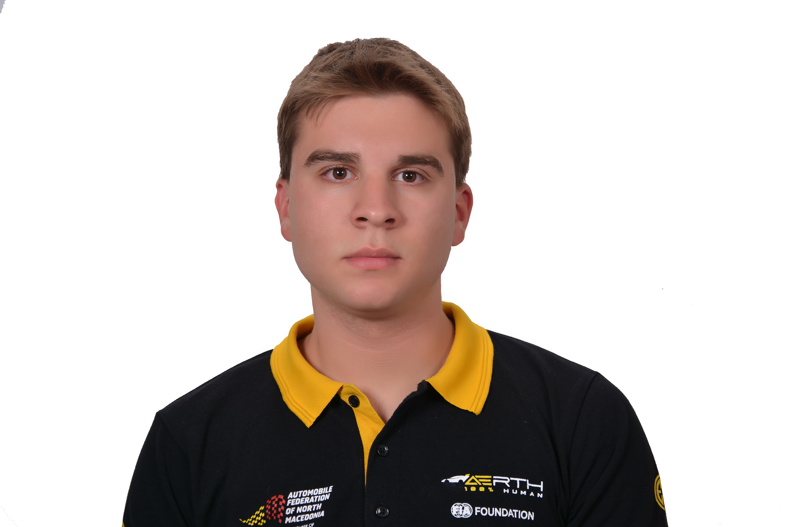

<!DOCTYPE html>
<html lang="en">
<head>
  <meta charset="UTF-8">
  <meta name="viewport" content="width=device-width, initial-scale=1.0">
  <meta name="description" content="Mario Blazevski's Personal Website">
  <title>Mario Blazevski | Portfolio</title>
  <link rel="stylesheet" href="style.css">
</head>
<body>
  <header>
    

      <h1>Mario Blazevski</h1>
      
Aerospace Engineer | STEM Advocate | Motorsport Visionary

    

  </header>

  <nav>
    <ul>
      <li><a href="#about">About Me</a></li>
      <li><a href="#professional_experience">Professional Experience</a></li>
      <li><a href="#portfolio">Portfolio</a></li>
      <li><a href="#blog">Blog</a></li>
      <li><a href="#contact">Contact</a></li>
    </ul>
  </nav>

  <main>
    <section id="about">
      <h2>About Me</h2>
      
      
      
      
Hello! Welcome to my portfolio! I'm Mario Blazevski, 
      a dedicated innovator and team leader from North Macedonia. With a profound interest in STEM, engineering, and motorsport, I have committed my career to merging these fields to create impactful projects and inspire future generations. 
      I am the President and Founder of Aerth Racing, an organization aimed at promoting STEM education through motorsport. As a leader, I have successfully managed teams that participated in prestigious global competitions, including F1 in Schools and Formula Student.
      My work emphasizes innovation, environmental sustainability, and hands-on learning experiences.

    </section>

    <section id="professional_experience">
      <h2>Professional Experience</h2>

      <h3>President and Founder</h3>
      <h4>Aerth Racing (2022–Present)</h4>
      
Established and led Aerth Racing, North Macedonia's first team to compete in the F1 in Schools World Finals.
Focused on promoting STEM education and sustainability through innovative racing projects.
Secured sponsorships, cultivated partnerships, and advanced the team's capabilities in engineering and project management.

      <h3>President, Technical Commission</h3>
      <h4>Automobile Federation of North Macedonia (2023–Present)</h4>
      
Led technical policy development in line with international FIA standards.
Championed environmental campaigns and road safety initiatives.

      <h3>Chief Mechanical Scrutineer</h3>
      <h4>Formula Student Alpe Adria, Czech Republic, and Portugal (2023–Present)</h4>
      
Ensured compliance with technical and safety standards in international student motorsport competitions.

    </section>

    <section id="portfolio">
  <h2>Portfolio</h2>
  

    

      <h3>Formula Student Macedonia</h3>
      
Founded the first Formula Student team in North Macedonia, focusing on building competitive race cars while promoting engineering excellence.

      
2022 - Present

    

    

      <h3>Aerth Racing</h3>
      
Led multiple innovative campaigns and designs that showcased the potential of youth talent in STEM and engineering.

      
2021 - Present

    

    

      <h3>H2O Colligo</h3>
      
Designed a water collection and electricity production system, recognized by the Fund for Innovations and Technology.

      
2020

    

  

</section>

    <section id="blog">
      <h2>Blog</h2>
      <article>
        <h3>[Blog Post Title]</h3>
        
[Brief introduction to the blog post content, sharing insights or experiences relevant to your field.]

      </article>
    </section>

    <section id="contact">
      <h2>Contact</h2>
      
Email: <a href="mailto:blazevskimario1@gmail.com">blazevskimario1@gmail.com</a>

      <button class="redirect-button" onclick="window.location.href='https://www.linkedin.com/in/mario-blazevski-774a31196/';">
        LinkedIn Mario Blazevski
      </button>

      <form>
        <label for="name">Name:</label>
        <input type="text" id="name" name="name" required>

        <label for="email">Email:</label>
        <input type="email" id="email" name="email" required>

        <label for="message">Message:</label>
        <textarea id="message" name="message" required></textarea>

        <button type="submit">Send</button>
      </form>
    </section>
  </main>

  <footer>
    
&copy; 2025 Mario Blazevski. All Rights Reserved.

  </footer>
</body>
</html>
